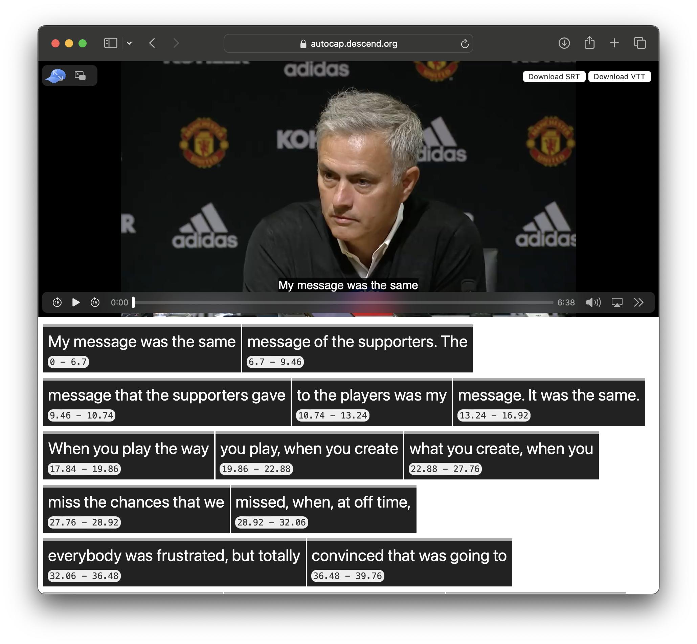

# autocap
All caps, no capping.

This is a demo using transformers.js and Whisper to generate caption files. It's meant as a proof of concept so a lot of features are missing and it's rough around the edges:

- doesn't use webworkers which makes the UI lockup during processing
- is mostly unstyled so the UI might be confusing
- no way to edit time chunks
- only uses small whisper model, which means a lot of errors

**Some things it does do:**

- 🏡 Fully clientside thanks to [transformers.js](https://github.com/xenova/transformers.js)
- 📝 Export to VTT and SRT formats.
- ✏️ Edit the transcription live

## todo
- [ ] Move transcription code to webworkers
- [ ] Allow users to select larger whisper models
- [ ] Add timestamp editing and the ability to add/remove text groups
- [ ] Translation to other languages?
- [ ] Add tailwind or something?
